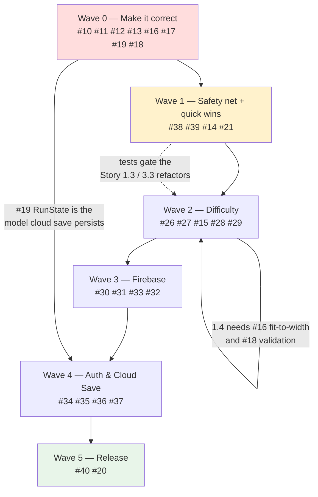

# HANGARoo — Delivery Roadmap

**Execution order for the 31 open issues.** Each item lists what it unblocks and **which EPIC it closes**.

| | |
|---|---|
| **Repository** | [`MrVirul/hangaroo`](https://github.com/MrVirul/hangaroo) |
| **Project board** | [HANGARoo Roadmap](https://github.com/users/MrVirul/projects/12) |
| **Issues** | 12 current bugs (#10–#21) · 4 EPICs (#22–#25) · 15 stories (#26–#40) |
| **Rules of record** | [`AGENTS.md`](../AGENTS.md) — prefab binding conventions, verification limits |

> **Verification note.** Per `AGENTS.md` there is no test suite, linter or CI, and the project cannot be built from the CLI (`Assembly-CSharp.csproj` hard-references `/Applications/Unity/Hub/Editor/6000.3.10f1/`). Until **Wave 1** lands, the only verification for every item below is opening the Unity editor and confirming a clean console. The items in Wave 1 exist to change that.

---

## Epic key

| EPIC | Theme | Closes when all its stories are done |
|---|---|---|
| **#22** | Difficulty Levels (Easy / Medium / Hard) | Stories 1.1–1.4 |
| **#23** | Firebase & Firestore Content Backend | Stories 2.1–2.4 |
| **#24** | Google Sign-In & Cloud Save | Stories 3.1–3.4 |
| **#25** | Platform Hardening & Release Readiness | Stories 4.1–4.3 |

EPICs use **native GitHub sub-issues**, so their progress roll-up is automatic:

```
#22 → #26 #27 #28 #29
#23 → #30 #31 #32 #33
#24 → #34 #35 #36 #37
#25 → #38 #39 #40
```

---

## Dependency graph



**Waves 3 and 4 are strictly sequential.** Wave 3 cannot start until Wave 2 lands, because the `WordRepository` returns `DifficultyConfig`-filtered words and Story 2.4 reorders ahead of 2.3. Wave 4 is blocked on Wave 2's `RunState` model.

---

## Wave 0 — Make the game correct and playable

**Epic closed by this wave: none.** These are standalone defects. They close themselves, but they are the precondition for every epic.

> ⚠️ **#10 and #13 must ship in the same PR.** #10 currently greys out keys as the *only* thing stopping score farming; #13 is the missing logic guard. Fixing either alone re-exposes the other. This is stated in both issues.

| # | Issue | Blocks | Closes |
|---|---|---|---|
| **#10** `critical` | Keyboard keys never re-enable — game unwinnable from word 2 | #28, #38 | *self* |
| **#13** `high` | `CheckLetter` has no idempotency guard | #28, #38 | *self* |
| **#11** `high` | Score uses cumulative `revealedCount` instead of the guess delta | #28 | *self* |
| **#12** `high` | `Restart()` does not reset `Time.timeScale` | — | *self* |
| **#19** `high` | No run lifecycle: hearts never refill, no exit from end panels, no completion state | **#26, #36** | *self* |
| **#16** `high` | Pause `Quit` does not quit · `FitSlotsToWidth()` is a no-op | #29 | *self* |
| **#17** `medium` | No live score readout — `scoreText` bound to the Victory panel | #28 | *self* |
| **#18** `medium` | Word order never reshuffles · `words.json` answers never validated | #29, #32 | *self* |

**Definition of done for Wave 0:** a full 65-word playthrough is winnable end to end with zero unavoidable dead ends; hearts refill per word; Pause → Restart and Pause → Quit both behave correctly; the score on the Victory panel matches a hand calculation.

---

## Wave 1 — Safety net, then quick wins

| # | Issue | Type | Closes |
|---|---|---|---|
| **#38** | EditMode + PlayMode test suite, runnable headlessly | Story 4.1 | **EPIC #25** (1 of 3) |
| **#39** | CI pipeline — Unity tests + content validator on every PR | Story 4.2 | **EPIC #25** (2 of 3) |
| **#14** | Three `AudioManager` copies — splash copy wins, `musicVolume` discarded | Bug | *self* |
| **#21** | Tech debt: 4 unreferenced scripts, deprecated API, `Reset To Default` | Bug | *self* |

### Why the test suite comes first, not last

`AGENTS.md` records that there is no test suite and no CI — and **every defect in Wave 0 is trivially testable**. That is how they reached `main`. Each already has its regression test specified in Story 4.1:

| Bug | Test that catches it |
|---|---|
| #10 keyboard | PlayMode: solve word 1 → Next → assert every key `interactable` |
| #11 scoring | EditMode: solve one word in two orders → equal totals |
| #12 timeScale | PlayMode: Pause → Restart → assert `timeScale == 1` |
| #13 idempotency | EditMode: `CheckLetter('A')` twice, no UI → identical state |
| #18 shuffle | EditMode: two seeded runs → orders differ |
| #18 validation | EditMode: reject `DON'T`, `NEW YORK`, duplicate answers |

Landing #38 **after** the Story 1.3 and 3.3 refactors means those refactors ship untested — which is how the current bugs got in. Do it here.

**Also in this wave:** #14 and #21 are low-risk, self-contained, and clear compiler/prefab noise. #21 additionally unblocks #27 (`SettingsUIResponsiveAdapter` must be attached and fixed before three new rows go into that panel).

**Definition of done:** `unity -runTests -testPlatform EditMode` runs headlessly and exits non-zero on failure; every Wave 0 bug has a regression test; the console is warning-free; exactly one `AudioManager` exists in the project.

---

## Wave 2 — Difficulty Levels (Easy / Medium / Hard)

| # | Issue | Type | Closes | Depends on |
|---|---|---|---|---|
| **#26** | `DifficultyConfig` asset type + `DifficultyLibrary` | Story 1.1 | **EPIC #22** (1 of 4) | — |
| **#27** | Difficulty selection UI, bound in `Settings_Panel.prefab` | Story 1.2 | **EPIC #22** (2 of 4) · **closes #15** | #21 |
| **#15** | Difficulty / Hints / ShowCategory settings do not exist | Bug | **closed by #27** | — |
| **#28** | Difficulty-aware rules: lives per word, hint policy, multiplier | Story 1.3 | **EPIC #22** (3 of 4) | #10 #11 #13 #17 #19 #26 #27 |
| **#29** | Partition and expand the word bank per difficulty, with validation | Story 1.4 | **EPIC #22** (4 of 4) · **closes #18 (reshuffle)** | #16 #26 |

### #15 is closed by a story, not by itself

`SettingsManager` already declares `difficultyDropdown`, `hintsToggle` and `showCategoryToggle`, but all three are `{fileID: 0}` — **the objects do not exist in `Settings_Panel.prefab`**, so the `Difficulty` and `Hints` `PlayerPrefs` keys are skipped by a null guard and read by nothing. Story 1.2 is the work that builds those objects, so **#15 should be closed as part of #27**, not separately.

The concrete player-facing symptom is that `GameManager.RefreshHint()` calls `hintText.gameObject.SetActive(true)` unconditionally — the hint is a **permanent second clue** for every player, un-disableable. Story 1.3 gates it properly.

### Per `AGENTS.md` — #27 binding rules

The shared `Settings_Panel.prefab` is instanced in both `MainMenu` and `GamePlay`. Scenes override only `RectTransform` / `m_IsActive`.

- Bind fields and `onClick` / `onValueChanged` **in the prefab**, never in the scenes.
- In-prefab targets must be the prefab's own component fileIDs, e.g. `m_Target: {fileID: -4216260151771862093}`.
- `m_Target: {fileID: 0}` means **unwired** — that is how the `Save` and `Reset To Default` buttons were previously found broken.
- `Settings_Panel` starts inactive (`m_IsActive: 0`), so `SettingsManager.Start` runs only after the panel opens. **Audio at startup stays `AudioManager.Awake`'s job**, per `AGENTS.md`.

### The seam to get right in #28

`HeartManager.Start()` currently seeds `lives` from `hearts.Length`, and `GameManager.Start()` calls `LoadWord()`. Unity runs all `Awake`s before all `Start`s, so there is no race today — but once hearts come from `DifficultyConfig`, **difficulty must resolve in `Awake` / run start, not inside `Start`.** Story 1.1 and Story 1.3 both call this out.

**Definition of done:** Easy/Medium/Hard are measurably distinct on all four axes (lives, word length, hint policy, multiplier); every difficulty is completable with zero dead ends; difficulty survives an app restart without opening the panel; EditMode tests cover all three.

---

## Wave 3 — Firebase & Firestore

> **Correction to the EPIC's listed order.** Story 2.4 must run **before** Story 2.3. `WordRepository` filters by `DifficultyId`, so the model has to carry it first. (#33 → #32 below.)

| # | Issue | Type | Closes | Depends on |
|---|---|---|---|---|
| **#30** | Install and configure the Firebase Unity SDK for all target platforms | Story 2.1 | **EPIC #23** (1 of 4) | — |
| **#31** | Firestore schema, indexes, security rules and seed tooling | Story 2.2 | **EPIC #23** (2 of 4) | #30 |
| **#33** | Migrate `WordData` to the Firestore content model | Story 2.4 | **EPIC #23** (3 of 4) | #31 #29 |
| **#32** | `WordRepository` with caching and offline fallback | Story 2.3 | **EPIC #23** (4 of 4) | #30 #31 #33 |

### #30 gates the entire Firebase plan — answer the WebGL question here

The Firebase project already exists, so this story is the client integration. The deliverable is **not** "the SDK compiles" — it is a **build succeeding on every platform in the target list**, plus a written platform support matrix.

**WebGL is the open risk.** It must be resolved and recorded *here*, before Story 3.1 is written, because Google sign-in in the Firebase Unity SDK is not uniform across platforms (native on Android/iOS, browser loopback on desktop, unverified on WebGL). If WebGL sign-in is not viable the options are (a) ship WebGL without cloud save, or (b) Firebase JS interop. Decide here, not halfway through Wave 4.

Also in #30: add `google-services.json` per target, gate `LogLevel` (dev `Warning` / release `Error`), guard every Firebase entry point against `FirebaseApp` not being ready, and **never commit a service-account or Admin SDK credential**.

### Hard requirements for #32

`GetWords()` **must never return an empty list and must never throw**. Three tiers, in order: Firestore → local cache (versioned) → bundled `words.json`.

- An **empty** remote result must not overwrite a valid cache.
- The word list resolves **once per run** and is held in memory — a mid-run network drop cannot change the difficulty, and per-word fetching would blow the Firestore read quota.
- The game must be fully playable on a fresh install with **networking disabled**.

**Definition of done:** content can be added in the Firebase Console and appears in-game without a build; security rules reject a client-side write (negative test); composite indexes deployed; the bundled fallback still passes validation; Firestore usage is within free tier.

---

## Wave 4 — Google Sign-In & Cloud Save

| # | Issue | Type | Closes | Depends on |
|---|---|---|---|---|
| **#34** | `AuthService` with Google provider, session restore and sign-out | Story 3.1 | **EPIC #24** (1 of 4) | #30 (+ **WebGL answer**) |
| **#35** | Sign-in UI and account panel | Story 3.2 | **EPIC #24** (2 of 4) | #34 |
| **#36** | `CloudSaveService` — sync run progress and per-difficulty stats | Story 3.3 | **EPIC #24** (3 of 4) | #19 #34 #35 |
| **#37** | Guest-to-account migration on first sign-in | Story 3.4 | **EPIC #24** (4 of 4) | #36 |

### The one hard product rule for this wave

**The game must be fully playable with no account and no network.** Sign-in is an upgrade, never a gate. Anonymous is the default and fires automatically; every screen and feature stays reachable; cancelling or failing sign-in lands the player in a playable state, never an error screen.

### #36 cannot start before #19 closes

There is nothing to sync. `GameManager.score` and `HeartManager.lives` are plain fields with no serialisation, and pressing Retry discards the score. **Sync `RunState`** — words solved, score, hints used, wrong guesses, difficulty, timestamps — not a bare score int, or the shape will be thrown away.

Local is the **primary** write path; the cloud is a replication target. Write on **run boundaries only** — never per guess, never per word. The offline queue must be persisted to disk and replayed idempotently on `runId`.

### #37 must never lose progress

Signing in must never make a player worse off than they were as a guest.

| Field | Rule |
|---|---|
| `bestScore`, `bestStreak` | `max(local, remote)` — never regress |
| `totalWordsSolved`, `totalRuns` | `sum` |
| `lastPlayedAt` | `max` |
| `RUN` documents | union by `runId`, sort by `endedAt`, keep newest 20 |

`sum` fields are the hazard: a double merge doubles a lifetime count. Guard with a transaction or a `migrationState` flag written in the same transaction as the merged document.

**Definition of done:** progress survives reinstall + sign-in; a guest's history is intact after signing in; offline play queues and replays without loss or duplication; rules enforce `request.auth.uid == userId` (negative test).

---

## Wave 5 — Release readiness

| # | Issue | Type | Closes |
|---|---|---|---|
| **#40** | Crash reporting, analytics and Remote Config | Story 4.3 | **EPIC #25 — CLOSED** |
| **#20** | Pause menu cannot quit · How to Play unreachable · splash cannot be skipped | Bug | *self* |

With #20 done and #40 done, **all four EPICs are closed** and #10–#21 are all resolved.

### #40 closes EPIC #25 and closes the balance loop

EPIC #25 closes when Stories 4.1, 4.2 and 4.3 are all done — #38 and #39 in Wave 1, #40 here.

Remote Config is how the difficulty numbers stop being a guess. They are documented in EPIC #22 as *"illustrative, needs playtesting"*, and there is currently no measurement of any kind. `difficulty.*.livesPerWord`, `hintThreshold`, `scoreMultiplier` and the feature flags become tunable **without a store release**.

Two rules that matter:

- **Never apply a value mid-run.** A run resolves difficulty at run start and holds it. Changing lives under a running player is a cheat or a punishment depending on direction.
- **`feature.cloudSaveEnabled` and `killSwitch.maintenance` are the safety valves.** If Wave 4 misbehaves in production, they must stop the bleeding without a store review. **Test by actually toggling them.**

### #20 — note the overlap with #16

#16 (Wave 0) owns the **code fix** for the pause-menu Quit/Exit duplication. #20 owns the remaining navigation consequences: the unreachable How to Play panel in GamePlay, the three dead `MainMenuManager` methods, and the unskippable splash. Do not re-implement the quit fix in #20.

---

## Epic closure summary

| EPIC | Closes when | Wave |
|---|---|---|
| **#22** Difficulty Levels | #26 #27 #28 #29 done | 2 |
| **#23** Firebase & Firestore | #30 #31 #33 #32 done | 3 |
| **#24** Google Sign-In & Cloud Save | #34 #35 #36 #37 done | 4 |
| **#25** Platform Hardening | #38 #39 **#40** done | 1, 1, 5 |

### Current bugs closed by epic work

| Bug | Closed by | Wave |
|---|---|---|
| **#15** settings fields unassigned | **#27** (Story 1.2) — builds the objects that do not exist | 2 |
| **#18** word order never reshuffles | **#29** (Story 1.4) — run-scoped shuffle | 2 |

All other Phase A bugs (#10 #11 #12 #13 #14 #16 #17 #19 #20 #21) are closed by their own work in the wave shown above.

---

## Working rules

1. **Verify in the editor, and say so.** Per `AGENTS.md`, open the project, confirm a clean console, then tell the user to check. Do not attempt a CLI build.
2. **Never hand-edit `.meta` files.** Let Unity regenerate them — `AGENTS.md` flags several as hand-authored stubs.
3. **Bind UI in the prefab, never in the scenes.** Scenes override only `RectTransform` / `m_IsActive`. `m_Target: {fileID: 0}` means unwired.
4. **Do not create a second `AudioManager`.** It is spawned in `splash` and `DontDestroyOnLoad`; `Awake` destroys duplicates.
5. **Commit on a feature branch**, conventional-commit style (`feat:`, `fix:`, `chore:`), opened as a PR. `AGENTS.md` records merges to `development`/`main` are done via PR.
6. **Close the issue and name the epic** when the work lands, so the sub-issue roll-up stays accurate.
7. **Write tests from the intended rules**, not the current implementation — otherwise they lock in the bugs they were written to catch.